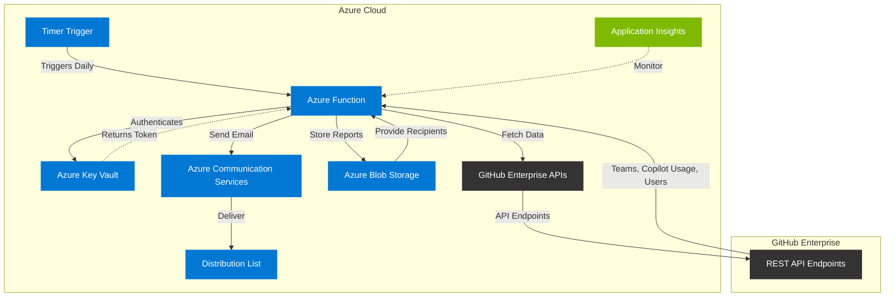

# GitHub Copilot Enterprise Activity Reporting System

## Architecture Diagram

## Flow Diagram and Documentation

### 1. System Overview

The GitHub Copilot Enterprise Activity Reporting System is an automated solution implemented as an Azure Function that collects, processes, and distributes GitHub Copilot usage data across an enterprise. The system generates daily CSV reports containing user-level activity information and team associations, stores these reports in Azure Blob Storage, and distributes them via email to designated recipients.

### 2. Architecture Components

#### 2.1 Azure Function
- **Type**: Timer-triggered function
- **Runtime**: Python
- **Schedule**: Runs daily
- **Role**: Orchestrates the entire process including data collection, processing, storage, and distribution

### 2.2 Azure Key Vault
- **Purpose**: Securely stores GitHub API authentication token
- **Access Method**: DefaultAzureCredential (supports managed identity in production)

### 2.3 GitHub Enterprise APIs
- **Teams API**: `/enterprises/{enterprise}/teams` - Retrieves all teams in the enterprise
- **Copilot Billing API**: `/enterprises/{enterprise}/copilot/billing/seats` - Gets Copilot usage data
- **User Details API**: `/users/{username}` - Fetches additional user information

### 2.4 Azure Blob Storage
- **Purpose 1**: Stores generated CSV reports with daily timestamps
- **Purpose 2**: Maintains email recipient list in JSON format
- **Container**: Configurable via environment variable (default: 'copilot-reports')

### 2.5 Azure Communication Services
- **Purpose**: Sends emails with the CSV report as an attachment
- **Recipients**: Fetched from a JSON file stored in Blob Storage

### 2.6 Application Monitoring
- The application includes extensive logging to track execution flow and errors
- Can be integrated with Application Insights for comprehensive monitoring

## 3. Detailed Process Flow

### 3.1 Function Trigger
1. **Timer Activation**: Azure Function is triggered by a timer based on a CRON expression
2. **Past Due Check**: Function checks if it's running due to a missed schedule

### 3.2 Configuration Loading
1. **Environment Variables**: Function loads configuration from environment variables
2. **Key Vault Access**: GitHub API token is retrieved securely from Azure Key Vault
3. **Configuration Validation**: Essential configuration parameters are verified

### 3.3 Data Collection Phase
1. **Team Data Collection**:
   - Function calls GitHub Enterprise Teams API
   - Handles pagination for large enterprises
   - Implements retry logic with exponential backoff
   - Respects GitHub API rate limits

2. **Copilot Billing Seats Collection**:
   - Function fetches billing seats information page by page
   - For each entry, extracts team and assignee information
   - Filters entries to include only relevant teams

3. **User Details Collection**:
   - For each user, additional details (email, account creation date) are fetched
   - Information from all sources is combined into comprehensive user records

### 3.4 Data Processing Phase
1. **Data Extraction**:
   - Username, email, and creation date are extracted
   - Last activity timestamp is recorded
   - Editor information is parsed into components:
     - Last active editor (VS Code, JetBrains, etc.)
     - Editor version
     - Plugin information
     - Plugin version
   - Team slug is extracted for organizational tracking

2. **CSV Generation**:
   - Data is formatted into a structured CSV file
   - Headers include all relevant fields
   - File is initially saved to local temporary storage

### 3.5 Storage Phase
1. **Blob Storage Upload**:
   - Function connects to Azure Blob Storage
   - Creates container if it doesn't already exist
   - Uploads CSV file with date-stamped filename
   - Handles connection string or managed identity authentication

### 3.6 Distribution Phase
1. **Email Recipients Retrieval**:
   - Function gets email recipient list from a JSON file in Blob Storage
   - Format validation ensures proper email list structure

2. **Email Preparation and Sending**:
   - Creates formatted HTML email content
   - Attaches the generated CSV report
   - Uses Azure Communication Services to send emails
   - Tracks delivery status

### 3.7 Error Handling and Resilience
1. **Retry Logic**: All API calls implement retry mechanisms with exponential backoff
2. **Rate Limiting Handling**: Function respects and adapts to GitHub API rate limits
3. **Exception Management**: Comprehensive exception handling with detailed logging
4. **Fallback Mechanisms**: Default values provided when data cannot be retrieved

## 4. Configuration Parameters

| Parameter | Description | Source |
|-----------|-------------|--------|
| GITHUB_ENTERPRISE_SLUG | GitHub Enterprise identifier | Environment Variable |
| KEY_VAULT_NAME | Azure Key Vault name | Environment Variable |
| GITHUB_AUTH_TOKEN_SECRET_NAME | Secret name in Key Vault | Environment Variable |
| AzureWebJobsStorage | Blob storage connection string | Environment Variable |
| BLOB_CONTAINER_NAME | Container for reports | Environment Variable |
| EMAIL_LIST_BLOB_PATH | Path to email list JSON | Environment Variable |
| COMMUNICATION_SERVICE_CONNECTION_STRING | Azure Communication Services connection | Environment Variable |
| SENDER_EMAIL | Email address to send from | Environment Variable |

## 5. Security Considerations

### 5.1 Authentication Security
- **GitHub API Token**: Stored securely in Azure Key Vault, never in code
- **Azure Resources**: Uses DefaultAzureCredential for authentication
- **Managed Identity**: Supports managed identities in production environment

### 5.2 Data Protection
- **At Rest**: Reports stored in secure Azure Blob Storage
- **In Transit**: All API calls use HTTPS
- **Email Security**: Emails sent through Azure Communication Services

### 5.3 Error Handling
- **Graceful Failure**: System handles errors gracefully with detailed logging
- **No Sensitive Data in Logs**: Care taken to avoid logging sensitive information

## 6. Deployment and Operation

### 6.1 Deployment Requirements
- Azure subscription with access to:
  - Azure Functions
  - Azure Key Vault
  - Azure Blob Storage
  - Azure Communication Services
- GitHub Enterprise account with API access
- Service principal or managed identity with appropriate permissions

### 6.2 Environment Setup
1. Create resource group for all components
2. Deploy Azure Key Vault and store GitHub token
3. Deploy Azure Storage Account with container
4. Upload email list JSON file to storage
5. Create Azure Communication Services resource
6. Deploy Azure Function with appropriate configuration

### 6.3 Monitoring and Maintenance
- Configure alerts for function failures
- Monitor GitHub API rate limit usage
- Review logs regularly for errors
- Update email recipient list as needed
- Rotate GitHub API token periodically

## 7. Example Output

The CSV report generated by the system contains the following fields for each user:

- Username
- Email
- Created At (account creation date)
- Last Activity At (last Copilot usage timestamp)
- Last Active Editor (e.g., VS Code, JetBrains)
- Editor Version
- Plugin (Copilot plugin used)
- Plugin Version
- Team Slug (team association)

This comprehensive view allows organizations to track Copilot usage patterns and ensure appropriate license allocation across teams.

---

## Technical Implementation Details

### Key Code Components

1. **Timer Trigger Configuration**:
   - The function is configured to run on a daily schedule
   - Implements past due checking to handle delayed executions

2. **Authentication Strategy**:
   - Uses DefaultAzureCredential for Azure resource authentication
   - Retrieves GitHub token from Key Vault for secure operation

3. **GitHub API Interaction**:
   - Handles pagination for large data sets
   - Implements rate limit detection and waiting
   - Uses exponential backoff for transient errors

4. **Resilience Patterns**:
   - Retry logic for all external API calls
   - Graceful error handling with appropriate logging
   - Fallback values to ensure report generation can continue

5. **Email Formatting and Delivery**:
   - HTML-formatted email for recipient readability
   - Properly attached CSV file
   - Asynchronous sending with completion tracking

### Implementation Best Practices

- **Configuration Management**: All configuration via environment variables
- **Secret Management**: Sensitive values stored in Key Vault
- **Error Handling**: Comprehensive try/except blocks with appropriate logging
- **Managed Identity**: Support for Azure managed identities in production
- **Detailed Logging**: Structured logging for monitoring and troubleshooting

---

This document provides a comprehensive overview of the GitHub Copilot Enterprise Activity Reporting System, its architecture, process flow, and implementation details. The system leverages Azure services to create a secure, reliable, and automated reporting solution for GitHub Copilot usage across enterprise organizations.
